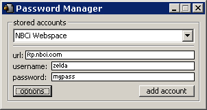



## Simple Password Manager

### Description

Simple password manager which stores your web/ftp/online accounts, etc. Poorly commented, sorry :/ Demonstrates lots of simple functions, great for beginners.
 
### More Info
 

             |
---                |---
**Submitted On**   |2001-03-04 12:24:38
**By**             |[Patrick Moore \(Zelda\)](https://github.com/Planet-Source-Code/PSCIndex/blob/master/ByAuthor/patrick-moore-zelda.md)
**Level**          |Beginner
**User Rating**    |4.3 (13 globes from 3 users)
**Compatibility**  |VB 5\.0, VB 6\.0
**Category**       |[Miscellaneous](https://github.com/Planet-Source-Code/PSCIndex/blob/master/ByCategory/miscellaneous__1-1.md)
**World**          |[Visual Basic](https://github.com/Planet-Source-Code/PSCIndex/blob/master/ByWorld/visual-basic.md)
**Archive File**   |[Simple Pas19273552001\.zip](https://github.com/Planet-Source-Code/patrick-moore-zelda-simple-password-manager__1-22984/archive/master.zip)

